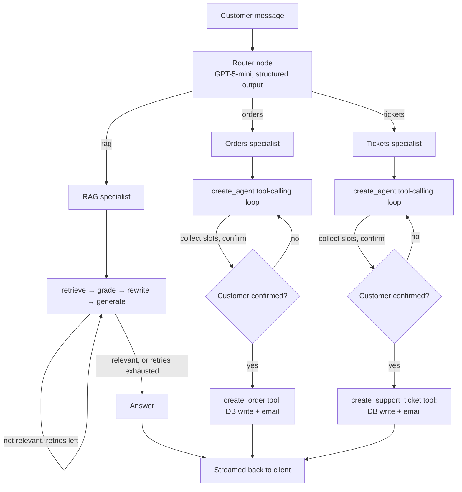

# Architecture

## Overview

The backend is a hand-rolled LangGraph supervisor pattern: a router
node classifies each customer message and hands off to one of three
specialist subgraphs. This is deliberate rather than using the
prebuilt `langgraph-supervisor` library — more control over routing
logic and streaming behavior, and more learning value in building it.

## The RAG specialist

This is the most "agentic" component by design: not a single
retrieve-then-generate pass, but an explicit loop.

1. **Retrieve** — embed the query and search Pinecone (top-k 3).
2. **Grade** — an LLM call with structured output judges whether the
   retrieved chunks actually contain enough to answer the question.
3. **Rewrite** (conditional) — if not relevant and a retry budget
   remains, the LLM rewrites the search query and the loop returns to
   retrieve. One retry by default.
4. **Generate** — produces the final answer grounded only in the
   retrieved context. The prompt explicitly instructs the model to
   say so if the context is insufficient, rather than guessing.

## Orders and tickets specialists

Built with LangChain's `create_agent` (a standard tool-calling ReAct
loop), not a hand-rolled graph — appropriate here since the job is
conversational slot-filling plus deciding when to call a tool, which
is exactly what a tool-calling agent is for.

The safety-critical part is the confirm-before-execute boundary:

- The agent collects required fields entirely through conversation.
- It presents a summary and waits for explicit confirmation.
- The `create_order` / `create_support_ticket` tools require every
  field as an argument, so they're structurally uncallable without
  complete data — and the system prompt explicitly forbids calling
  them before the customer's explicit confirmation.
- Once a tool *is* called, what happens inside it (the database write,
  then the email) is plain deterministic Python — not another LLM
  decision.

## Memory

Two independent Postgres concerns, both in the same database instance:

- **Business data** — `orders` and `support_tickets` tables, managed
  by SQLAlchemy 2.0 (async) and versioned with Alembic migrations.
- **Conversation checkpoints** — LangGraph's `AsyncPostgresSaver`
  stores the full message history per `thread_id`, which is set as a
  browser cookie. Every graph invocation loads prior state by
  `thread_id` before responding, so conversations survive refreshes
  and server restarts. This is a separate schema that Alembic doesn't
  manage — it's created automatically via `checkpointer.setup()` at
  application startup.

## Ingestion pipeline

A standalone script (`ingestion/load_to_pinecone.py`), run manually
whenever the reference PDF changes — not part of the running API.

1. Extract text from the PDF (`pypdf`).
2. Chunk it (`RecursiveCharacterTextSplitter`, 500 chars / 100
   overlap).
3. Embed each chunk (`text-embedding-3-small` via Azure OpenAI's v1
   API).
4. Upsert into Pinecone in batches of 50, with deterministic
   chunk IDs (hash of source + chunk index) so re-running the script
   on an updated PDF overwrites existing vectors instead of
   duplicating them.

## Model selection

Cost-tiered by task complexity — cheaper models for simple
classification, stronger models where answer quality matters:

| Role | Model |
|---|---|
| Router (intent classification) | GPT-5-mini |
| RAG (grading, rewriting, generation) | GPT-5-mini |
| Orders / Tickets (conversation, tool calling) | GPT-5-mini |
| Embeddings | text-embedding-3-small |

All Azure OpenAI calls go through the v1 API (`base_url` +
`api_key`, no `api_version` required) via `langchain_openai`'s
`ChatOpenAI` / `OpenAIEmbeddings`, pointed at the Azure endpoint —
not the legacy versioned `AzureChatOpenAI` client.

## Streaming

The FastAPI `/chat` endpoint streams via `graph.astream(...,
stream_mode="messages")`, which emits LLM tokens as they're
generated — including from nodes that call `.invoke()` internally,
not just `.stream()`. The router's own internal structured-output
tokens are filtered out of the client-facing stream (via
`metadata["langgraph_node"]`) so customers only see the actual
specialist's response, never the routing decision itself.

## Frontend

Next.js App Router storefront with an embedded chat widget. The
widget and the storefront share state through a React context
(`ChatWidgetContext`), so a product card's "Ask about ordering"
button can open the widget and send a real order-intent message —
the storefront and the agent are functionally connected, not just
visually adjacent.
